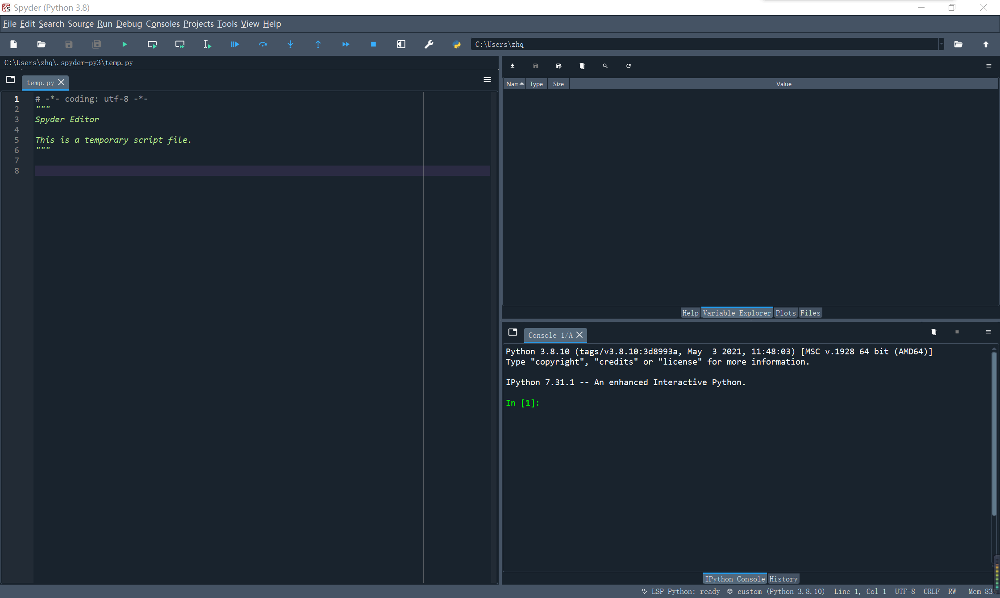

# Spyder(IDE)安装

Spyder需要用pip进行安装，用这个命令（-i http://xxx 是用于在安装库时指定下载源的）：

```
pip install spyder -i https://mirrors.aliyun.com/pypi/simple/
```

Spyder依赖很多第三方库，在安装Spyder时，它会帮我们自动安装。几分钟后，安装应该完成了，如果终端出现Successfully installed，说明安装成功！然后我们在终端内直接输入spyder，按下回车，就可以打开了。

 (1) (1).png>)


